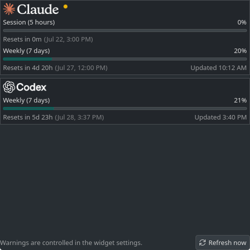
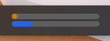

# AI Usage Tracker

A personal KDE Plasma 6 panel widget for displaying Claude Code and OpenAI Codex subscription usage.

It installs as `com.michaelteuscher.aiusagetracker`. The widget asks the locally installed Claude Code and Codex CLIs for their subscription limits; it never reads or stores provider credentials.





## Install

```sh
./scripts/install.sh
```

Then open **Add Widgets** in KDE Plasma and add **AI Usage Tracker** to the bottom panel.

Earlier versions added a Claude status-line relay. The installer removes it (after backing up `~/.claude/settings.json`) only if the status line still points at that relay.

### Requirements

- KDE Plasma 6 with `kpackagetool6`
- Python 3, `jq`, and `xmllint`
- `notify-send` for optional desktop warnings
- Claude Code and/or Codex CLI, signed in with a supported subscription

The widget detects which CLIs are available. A missing CLI hides that provider and disables its corresponding setting.

## Refresh and limits

The widget refreshes both providers every minute by default:

- **Claude Code** is started headlessly and asked for the same data as its `/usage` panel through the stream-json `get_usage` control request. No prompt is sent, and the probe skips hooks, MCP servers, and session persistence. Claude marks this request experimental, so a Claude Code update may change it.
- **Codex** is asked for `account/rateLimits/read` through `codex app-server`.

Each card shows every window the provider reports, including per-model weekly limits. Bars start full and drain as you use quota. The thin line on each bar marks how much of the window's time is left; a fill shorter than the line means you are spending faster than the window elapses ("Ahead of pace").

If a read fails, the card keeps the last successful reading and a yellow dot appears beside the logo; hover it for the reason. A red dot means the provider has no data to show, such as a Claude API-key account or a Codex login without a ChatGPT subscription.

## Settings

Right-click the panel widget and select **Configure AI Usage Tracker…** to choose:

- Refresh interval
- Desktop warning toggle (warnings use 75% and 90% thresholds)
- Compact, standard, or wide panel width
- Whether to show Claude Code and/or OpenAI Codex

## GitHub Releases

For releases, download the source archive, verify its published SHA-256 checksum, extract it, and run `./scripts/install.sh`. Release archives must contain the complete repository: the Plasma package, Python collector, and install scripts are all required.

For local development, run `./scripts/refresh.sh` to validate packaged QML/SVG/XML files, reinstall the widget, and restart Plasma.

Run `./scripts/uninstall.sh` to remove the installed widget, collector, and saved state.
